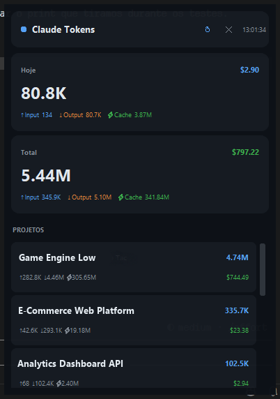

<div align="center">
  

  # Claude Token Monitor

  Monitor de tokens do **Claude Code** na bandeja do Windows.
  Lê arquivos locais — sem API, sem custo extra.

  
</div>

---

## O que é

Claude Token Monitor é um app leve que fica na bandeja do sistema e mostra em tempo real quanto você está usando do seu limite de tokens do Claude Code — incluindo o consumo de hoje, o histórico total, o uso da janela atual e o tempo até o próximo reset.

---

## Funcionalidades

- **Ícone na bandeja** — sempre visível, sem janelas abertas
- **Hover no ícone** — mostra % de uso e tempo até o reset sem precisar abrir nada
- **Tokens de hoje** — consumo do dia com custo estimado em USD
- **Total acumulado** — histórico de todas as sessões desde o início
- **Sessão atual** — barra de progresso com % do limite e countdown do reset
- **Por projeto** — cada repositório com input, output, cache e custo
- **Notificações nativas** — alerta ao atingir 70% e aviso 60 min antes do reset
- **Calibração** — sincroniza os valores com a página real do Claude Code
- **Atualização automática** — dados recarregados a cada 30 segundos

---

## Requisitos

- Windows 10 ou 11
- Python 3.10 ou superior
- Claude Code instalado com histórico em `~/.claude/`

---

## Instalação

**1. Clone o repositório**
```bash
git clone https://github.com/seu-usuario/claude-token-monitor.git
cd claude-token-monitor
```

**2. Instale as dependências**
```bash
pip install -r requirements.txt
```

Ou clique duas vezes em `install.bat`.

---

## Como usar

```bash
python main.py
```

Ou clique duas vezes em `run.bat`.

O app inicia **minimizado na bandeja**. O ícone azul **CT** aparece no canto inferior direito da tela.

### Ações disponíveis

| Ação | Como fazer |
|---|---|
| Abrir ou fechar a janela | Clique no ícone CT |
| Ver % e reset sem abrir | Passe o mouse sobre o ícone CT |
| Atualizar os dados | Botão **↻** no cabeçalho |
| Calibrar os limites | Botão **⚙** no cabeçalho |
| Fechar só a janela | Botão **✕** ou clique fora |
| Mover a janela | Arraste pelo cabeçalho |
| Encerrar o app | Botão direito no ícone → Sair |

---

## Calibração

O Claude Code calcula o uso internamente — o app não tem acesso direto a esses dados. A calibração resolve isso: você informa os valores reais e o app ajusta automaticamente.

**Quando calibrar:** na primeira vez que instalar e sempre que a % ou o tempo mostrarem diferença em relação à página do Claude Code.

### Passo a passo

**1.** Abra [claude.ai/settings/claude-code](https://claude.ai/settings/claude-code) e anote:
- O **percentual de uso atual** — exemplo: `28%`
- O **tempo até o próximo reset** — exemplo: `3h 45min`

**2.** No app, clique em **⚙**

**3.** Preencha os campos:

```
LIMITE DE USO:   28      %
TEMPO ATÉ RESET: 3   h  45  min
```

**4.** Clique em **Calibrar**

O app recalcula o limite de tokens com base na proporção e ancora o próximo reset no horário exato. Todos os resets seguintes são extrapolados automaticamente de 5 em 5 horas.

---

## Notificações

O app verifica os limites a cada 60 segundos e envia notificações nativas do Windows:

**Ao atingir 70% do limite:**
> ⚠️ Limite de uso em 70%
> 374.8K / 1.48M tokens usados. Considere iniciar uma nova sessão em breve.

**60 minutos antes do reset:**
> 🔄 Reset de limites próximo
> Falta apenas 58 minutos para resetar seus limites de uso.

Cada notificação dispara uma única vez por janela de reset.

---

## Como funciona

O Claude Code salva o histórico de cada conversa em arquivos `.jsonl` locais:

```
~/.claude/projects/<nome-do-projeto>/<session-id>.jsonl
```

Cada resposta contém um campo `usage` com os tokens consumidos:

```json
{
  "input_tokens": 108,
  "output_tokens": 1240,
  "cache_creation_input_tokens": 512,
  "cache_read_input_tokens": 94300
}
```

O app lê todos esses arquivos, filtra pelo período relevante e agrega por projeto e data. O `cache_read_input_tokens` é excluído do cálculo de limite pois não contabiliza no rate limit da Anthropic.

### Custo estimado — preços por 1 M tokens

| Modelo | Input | Output | Cache criação | Cache leitura |
|---|---|---|---|---|
| Claude Opus 4.8 | $15.00 | $75.00 | $18.75 | $1.50 |
| Claude Sonnet 4.6 | $3.00 | $15.00 | $3.75 | $0.30 |
| Claude Haiku 4.5 | $0.80 | $4.00 | $1.00 | $0.08 |

Valores baseados na tabela da Anthropic. Confirme em [anthropic.com/pricing](https://www.anthropic.com/pricing).

---

## Configurações

Edite o topo de `main.py` para ajustar o comportamento:

| Variável | Padrão | Descrição |
|---|---|---|
| `ALERT_PCT` | `0.70` | % para disparar notificação de limite |
| `RESET_INTERVAL_H` | `5` | Duração da janela de uso em horas |
| `RESET_WARN_MINS` | `60` | Minutos antes do reset para notificar |

Após a calibração, o arquivo `config.json` é criado automaticamente:

```json
{
  "session_limit": 1484000,
  "reset_anchor": "2026-06-29T17:15:00+00:00"
}
```

| Chave | Descrição |
|---|---|
| `session_limit` | Limite de tokens calibrado |
| `reset_anchor` | Instante UTC do próximo reset |

---

## Iniciar com o Windows

Para o app abrir automaticamente com o Windows:

1. Pressione `Win + R` e execute `shell:startup`
2. Crie um atalho de `run.bat` nessa pasta

---

## Estrutura do projeto

```
claude-token-monitor/
├── docs/
│   ├── logo.png          # Ícone do app
│   └── preview.png       # Screenshot
├── main.py               # Aplicação principal
├── config.json           # Calibração salva (gerado automaticamente)
├── requirements.txt      # Dependências
├── install.bat           # Instala dependências
├── run.bat               # Inicia o app
└── README.md
```

---

## Privacidade

Este app não envia nenhum dado para a internet.
Lê apenas os arquivos locais em `%USERPROFILE%\.claude\` e não faz nenhuma requisição de rede.

---

## Licença

```
MIT License

Copyright (c) 2026

Permission is hereby granted, free of charge, to any person obtaining a copy
of this software and associated documentation files (the "Software"), to deal
in the Software without restriction, including without limitation the rights
to use, copy, modify, merge, publish, distribute, sublicense, and/or sell
copies of the Software, and to permit persons to whom the Software is
furnished to do so, subject to the following conditions:

The above copyright notice and this permission notice shall be included in all
copies or substantial portions of the Software.

THE SOFTWARE IS PROVIDED "AS IS", WITHOUT WARRANTY OF ANY KIND, EXPRESS OR
IMPLIED, INCLUDING BUT NOT LIMITED TO THE WARRANTIES OF MERCHANTABILITY,
FITNESS FOR A PARTICULAR PURPOSE AND NONINFRINGEMENT. IN NO EVENT SHALL THE
AUTHORS OR COPYRIGHT HOLDERS BE LIABLE FOR ANY CLAIM, DAMAGES OR OTHER
LIABILITY, WHETHER IN AN ACTION OF CONTRACT, TORT OR OTHERWISE, ARISING FROM,
OUT OF OR IN CONNECTION WITH THE SOFTWARE OR THE USE OR OTHER DEALINGS IN THE
SOFTWARE.
```
